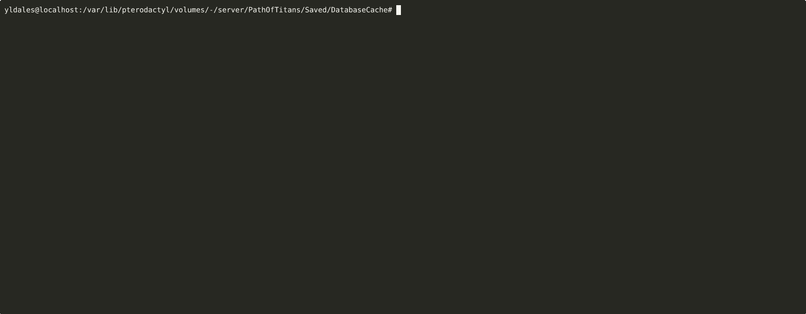

# Path of Titans Characters Limit Mitigator

> ## Patch 37200 Hotfix 23
> 
>  **Important: Changes to game max supported character limit for Community > Servers:**
> - <mark>Changed: The maximum officially supported character limit on all Community servers is now 50</mark>. This change was made due to a number of community servers previously setting the maximum character limit to a very high number, which could break players from being able to login and play on that server. <mark>Servers that previously had a character limit higher then 50 will now be clamped to 50</mark>. We understand the community need to have a large amount of characters, especially when playing with modded creatures, however the game in its current state is not designed to scale well with this many characters. For community servers, we recommend server owners picking a selection of mods that work well with your server's intended playstyle. If a community server would like to expand, it is suggested they host a second server with a different set of mods.
> - We plan on updating the game to better support handling a higher number of saved characters in the future. When this happens, we will expand the character limit.

## 🔎 What's this script do?
**tl;dr**: Normaly, players with more than 50 characters must delete "exceeding" characters to be able to play on the server. This script is a workaround to keep all characters while respecting the 50 characters limit. It will store the "exceeding" characters data in a separate folder, allowing you to restore them later, when the limit will be increased.

|  | 
|:--:| 
| *Running `python3 app.py --backup` with the CHARACTERS_LIMIT set to 3.* |

## ⚠ Warnings & Disclaimers
1. **This script was made in a hurry** and has not been thoroughly tested. Use it at your own risk. Note that the script will create a .zip file or both `Account` and `Character` folders before making any changes. This is to ensure that you can roll back the changes if something goes wrong.
2. This script must be run while the server is offline.

## 📜 Usage

1. Download the app.py script.
2. Put the script in the same directory as the `Account` and `Character` folders.
3. At the beginning of the script, update `CHARACTERS_LIMIT`, `CHARACTERS_PATH`, `PLAYERS_PATH` & `TRIMMED_CHARACTERS_PATH` variables.
4. Use `python app.py` or `python3 app.py` to run the script.

### 🖥️ Arguments
```python
usage: app.py [-h] [--backup] [--restore] [--sort-by {marks,actualGrowth,lastPlayedDate}] [--simulate]

Path of Titans Characters Limit Workaround

optional arguments:
  -h, --help            show this help message and exit
  --backup              Trim the characters to respect the CHARACTERS_LIMIT.
  --restore             Restore the trimmed characters.
  --sort-by {marks,actualGrowth,lastPlayedDate}
                        Sort characters by the specified attribute.
  --simulate            Simulate the trimming process without modifying the files.
```